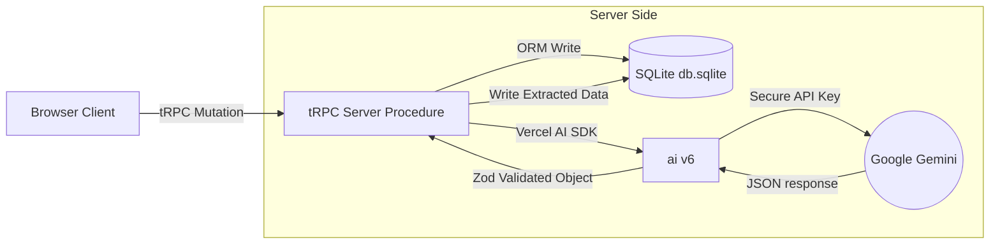

# 🤖 AI Integration & Gemini Prompt Strategy

This article outlines our AI integration architecture, detailing how **Google Gemini** connects with **Vercel AI SDK v6** server-side, and explores our habit extraction and nudging strategies.

---

## 🏗️ The AI Architecture

Introspect isolates all AI processing server-side. **No AI API calls occur in the browser.** This keeps client bundles lightweight, shields API keys from theft, and provides centralized control over prompting.



### 🛠️ Core Libraries
* **`ai` (Vercel AI SDK v6)**: A robust framework for communicating with LLMs. We leverage its high-level `generateObject` and `generateText` APIs.
* **`@ai-sdk/google`**: Official Google AI provider interface, configured to utilize Gemini models.
* **`zod`**: Schema validator used to strictly validate AI outputs at runtime before writing them to SQLite.

---

## 🔒 Key Setup & Validation (`src/env.js`)

Our Gemini API keys are retrieved securely from environment variables. During startup, the application verifies the key's presence via the `t3-env` schema:

* **`.env` Configuration**:
  ```bash
  GOOGLE_GENERATIVE_AI_API_KEY=AIzaSy... # Obtained from aistudio.google.com
  ```
* **Schema Validation (`src/env.js`)**:
  ```typescript
  server: {
    GOOGLE_GENERATIVE_AI_API_KEY: z.string().min(1),
  }
  ```

---

## ⚡ The Two AI Workflows

We optimize LLM costs and processing latency by mapping all AI tasks to **exactly two key execution vectors**:

### 1. The Real-time Habit & Nudge Extractor (Triggers: On Entry Save)
When a user finishes writing a daily journal entry, a backend mutation procedure triggers. We send the new entry alongside historical context to Gemini. We use `generateObject()` to enforce a type-safe JSON response matching a Zod schema.

#### The Zod Schema Structure
```typescript
import { z } from "zod";

export const aiExtractionSchema = z.object({
  habits: z.array(
    z.object({
      name: z.string().describe("The name of the detected habit, capitalized. Limit to 3 words."),
      sentiment: z.enum(["positive", "negative", "neutral"]).describe("Whether this habit helps, hurts, or is neutral to the user's wellbeing."),
    })
  ).describe("List of recurring habits or behavioral patterns detected in this journal entry."),
  
  nudge: z.string().describe("A single, highly specific, 2-minute actionable nudge based on their current state. Keep it ultra-practical."),
});
```

#### The Extraction Prompt Architecture
```
System Prompt:
You are an expert behavioral psychologist and executive coach assisting a user in building productive, healthy habits.
Your task is to analyze their latest journal entry, compare it to recent entries, and identify any active habits or behaviors.
For each habit, categorize it as positive, negative, or neutral.
Finally, generate exactly ONE "2-minute nudge" — a physical, immediate, simple action they can take right now to maintain momentum or correct a negative trend.

Context Details:
- Previous Entries: [Last 5 entries formatted with dates]
- Latest Entry: [The entry the user just saved]
```

Upon receiving the validated JSON object:
1. We iterate over the `habits` list, searching SQLite for existing entries by name.
2. If a habit matches, we **increment its occurrences counter** and update its `lastSeen` and `sentiment`.
3. If it is new, we insert a new record into `introspect_habits`.
4. We write the generated `nudge` into `introspect_nudges`, linked directly to the entry ID.

---

### 2. Deep Trajectory Analyst (Triggers: On Dashboard Load)
When the user visits the Insights dashboard, we retrieve all accumulated habits from `introspect_habits`. If sufficient data exists, we execute `generateText()` to compile an executive coaching brief.

#### The Insights Prompt Architecture
```
System Prompt:
You are Introspect AI, an empathetic and analytical behavioral scientist.
Analyze the user's habit records and compile a concise 3-sentence executive brief summarizing their behavior.

Input Records:
[List of habits, sentiment evaluations, and occurrence counters]

Output Guidelines:
- Sentence 1: Highlight their most successful positive habit streak and why it's working.
- Sentence 2: Address their most repeating negative habit, detailing what triggers it and a quick remediation cue.
- Sentence 3: State their overall weekly behavior trajectory (Improving / Slipping / Plateaud) with a word of reinforcement.
```

---

## 💡 Prompt Engineering & Token Efficiency Rules

To keep the application highly responsive and cost-effective, we adhere to three strict prompting principles:

1. **Minimize History Window**: We cap historical entries sent during habit extraction at the **last 5 entries**. Sending months of history swells token consumption and causes response latency to climb.
2. **Strict Temperature Controls**: We configure `temperature` at `0.1` or `0.2` for extraction tasks. This forces the model to be highly consistent and reduces "hallucinations" of habits the user didn't mention.
3. **Structured Outputs Only**: We never use open-ended text generations for database writes. Enforcing structured Zod schemas with `generateObject()` eliminates JSON parsing failures and invalid field values, preventing backend runtime crashes.
4. **Offline Cache Check**: We only call the Deep Trajectory Analyst if new entries have been saved since the last compiled summary. If no new data has been written, we display the previously cached AI insight from the DB, ensuring instantaneous page loads.
