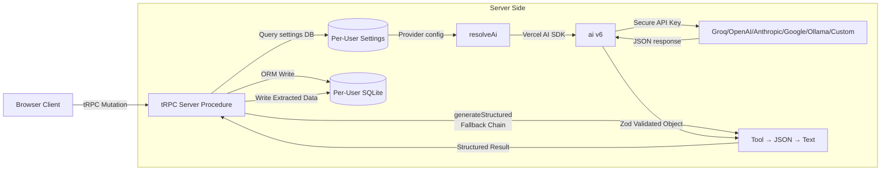

# 🤖 AI Integration & Multi-Provider Strategy

This article outlines our AI integration architecture, detailing how **multi-provider LLM support** (Groq, OpenAI, Anthropic, Google, Ollama, or custom) connects with **Vercel AI SDK v6** server-side, and explores our habit extraction and nudging strategies.

---

## 🏗️ The AI Architecture

Introspect isolates all AI processing server-side. **No AI API calls occur in the browser.** This keeps client bundles lightweight, shields API keys from theft, and provides centralized control over prompting. Users can configure their preferred AI provider with their own API key, or fall back to Groq (default).



### 🛠️ Core Libraries
* **`ai` (Vercel AI SDK v6)**: Provider-agnostic LLM framework. We use `generateText` with tool calling, `generateObject` for JSON mode, and plain text fallback.
* **`@ai-sdk/*` providers**: Modular adapters for Groq, OpenAI, Anthropic, Google, Ollama, and OpenAI-compatible endpoints.
* **`zod`**: Schema validator used to strictly validate AI outputs at runtime before writing them to SQLite.
* **`src/server/ai/structured.ts`**: Fallback chain orchestrator (tool → JSON → text regex) for robust structured output across models.

---

## 🔒 Key Setup & Validation

AI provider configuration is **per-user**, stored in the `introspect_settings` table (singleton row `id = "default"`). Environment variables provide server-wide defaults:

* **User Settings (DB)**:
  The `settings` table stores:
  ```typescript
  provider: "groq" | "openai" | "anthropic" | "google" | "ollama" | "custom" | "hosted"
  model: string  // e.g., "llama-3.3-70b-versatile" for Groq
  apiKey: string // User's API key (encrypted at rest if possible)
  baseUrl: string // Custom endpoint for ollama/custom
  mode: "auto" | "tool" | "json"  // Structured output strategy
  tier: "hosted" | "byo" | "selfhost"  // Billing model
  ```

* **Environment Defaults (`src/env.js`)**:
  ```bash
  # Default provider if user has no settings row
  AI_PROVIDER=groq
  AI_MODEL=llama-3.3-70b-versatile
  GROQ_API_KEY=...       # From groq.com console
  OPENAI_API_KEY=...     # Optional fallback
  ANTHROPIC_API_KEY=...  # Optional fallback
  GOOGLE_GENERATIVE_AI_API_KEY=...  # Optional fallback
  AI_BASE_URL=...        # Custom Ollama endpoint (e.g., http://localhost:11434/v1)
  ```

* **Resolution Flow** (`src/server/ai/provider.ts`):
  1. Query user's `settings` row from per-user DB
  2. If `provider` and `model` are set, use those
  3. Otherwise, fall back to `AI_PROVIDER`, `AI_MODEL`, and corresponding `*_API_KEY` env vars
  4. Default: Groq at `localhost:11434` (requires local Ollama in dev)

---

## ⚡ The Two AI Workflows

We optimize LLM costs and processing latency by mapping all AI tasks to **exactly two key execution vectors**:

### 1. The Real-time Habit & Nudge Extractor (Triggers: On Entry Save)
When a user finishes writing a daily journal entry, a backend mutation procedure triggers. We send the new entry alongside historical context to the AI provider. We use `generateStructured()` (from `src/server/ai/structured.ts`) with a fallback chain to extract structured data reliably across all model types.

#### The Zod Schema Structure
```typescript
import { z } from "zod";

export const aiExtractionSchema = z.object({
  habits: z.array(
    z.object({
      name: z.string().describe("The name of the detected habit, capitalized. Limit to 3 words."),
      sentiment: z.enum(["positive", "negative", "neutral"]).describe("Whether this habit helps, hurts, or is neutral to the user's wellbeing."),
    })
  ).describe("List of recurring habits or behavioral patterns detected in this journal entry."),
  
  nudge: z.string().describe("A single, highly specific, 2-minute actionable nudge based on their current state. Keep it ultra-practical."),
});
```

#### The Structured Output Strategy
`generateStructured(opts)` from `src/server/ai/structured.ts` uses a **fallback chain**:
1. **Tool calling** (fastest, most reliable for capable models) — calls the tool with structured input
2. **JSON mode** (via `generateObject`) — if tool calling fails or unsupported
3. **Plain text + regex** — final fallback for models without structured output support

This ensures extraction works across Groq 70B, small local Llama models, Gemma, and everything in between.

#### The Extraction Prompt Architecture
```
System Prompt:
You are an expert behavioral psychologist and executive coach assisting a user in building productive, healthy habits.
Your task is to analyze their latest journal entry, compare it to recent entries, and identify any active habits or behaviors.
For each habit, categorize it as positive, negative, or neutral.
Finally, generate exactly ONE "2-minute nudge" — a physical, immediate, simple action they can take right now to maintain momentum or correct a negative trend.

Context Details:
- Previous Entries: [Last 5 entries formatted with dates]
- Latest Entry: [The entry the user just saved]
```

**Structured Extraction Call**:
```typescript
const result = await generateStructured({
  model,
  schema: aiExtractionSchema,  // Zod schema for habits + nudge
  toolName: "extract_habits",
  toolDescription: "Extract habits and nudge from user journal entry",
  system: systemPrompt,
  prompt: userPrompt,
  mode: config.mode,  // "auto" | "tool" | "json" (from settings)
});
```

Upon receiving the validated object:
1. We iterate over the `habits` list, searching SQLite for existing entries by name.
2. If a habit matches, we **increment its occurrences counter** and update its `lastSeen` and `sentiment`.
3. If it is new, we insert a new record into `introspect_habits`.
4. We write the generated `nudge` into `introspect_nudges`, linked directly to the entry ID.

---

### 2. Deep Trajectory Analyst (Triggers: On Dashboard Load)
When the user visits the Insights dashboard, we retrieve all accumulated habits from `introspect_habits`. If sufficient data exists, we execute `generateText()` to compile an executive coaching brief.

#### The Insights Prompt Architecture
```
System Prompt:
You are Introspect AI, an empathetic and analytical behavioral scientist.
Analyze the user's habit records and compile a concise 3-sentence executive brief summarizing their behavior.

Input Records:
[List of habits, sentiment evaluations, and occurrence counters]

Output Guidelines:
- Sentence 1: Highlight their most successful positive habit streak and why it's working.
- Sentence 2: Address their most repeating negative habit, detailing what triggers it and a quick remediation cue.
- Sentence 3: State their overall weekly behavior trajectory (Improving / Slipping / Plateaud) with a word of reinforcement.
```

---

## 💡 Prompt Engineering & Token Efficiency Rules

To keep the application highly responsive and cost-effective, we adhere to strict prompting principles:

1. **Provider-Agnostic Latency**: Groq is the default (fast, affordable), but users can BYO key or self-host Ollama. Each provider has different latency/cost profiles; keep prompts concise to stay within typical serverless timeouts (<10s on Vercel).
2. **Minimize History Window**: We cap historical entries sent during habit extraction at the **last 5 entries**. Sending months of history swells token consumption and causes response latency to climb.
3. **Strict Temperature Controls**: We configure `temperature` at `0.1` or `0.2` for extraction tasks. This forces the model to be highly consistent and reduces "hallucinations" of habits the user didn't mention.
4. **Structured Outputs via Fallback Chain**: We use `generateStructured()` instead of raw `generateText()` or `generateObject()`. The fallback chain (tool → JSON → text) ensures extraction works even for weaker models without crashing on malformed JSON.
5. **Offline Cache Check**: We only call the Deep Trajectory Analyst if new entries have been saved since the last compiled summary. If no new data has been written, we display the previously cached AI insight from the DB, ensuring instantaneous page loads.
6. **Per-User Mode Configuration**: Each user can set `mode` in settings to force "tool", "json", or "auto" behavior — enabling performance tuning for their chosen provider.
