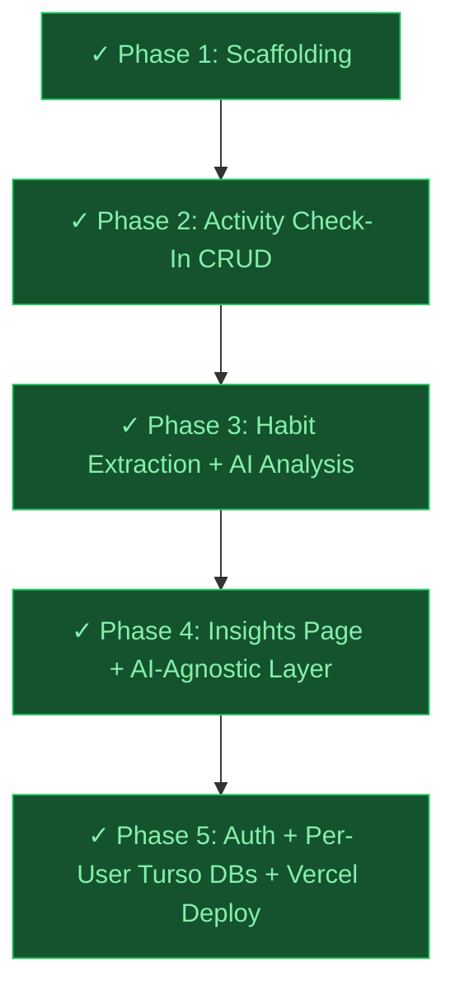
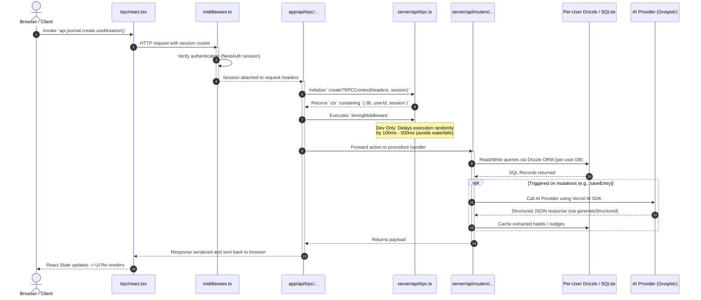

# 🏛️ Architecture & System Design

This article provides an in-depth breakdown of the software stack, folder structures, phase-based progression, and request-response lifecycle of the **Introspect** application.

---

## 🛠️ The Technology Stack

Introspect is built using a modern, unified, type-safe TypeScript architecture:

* **Framework**: [Next.js 15](https://nextjs.org/) (App Router, React 19) — utilizing Server Components for initial renders and Client Components for interactive UI.
* **API Layer**: [tRPC 11](https://trpc.io/) — providing end-to-end type safety between the frontend and backend without generating boilerplate client code.
* **Database Driver & ORM**: [LibSQL/SQLite](https://github.com/tursodatabase/libsql) + [Drizzle ORM](https://orm.drizzle.team/) — per-user Turso databases in production; local SQLite files in development.
* **Auth**: [NextAuth v5 (Auth.js beta)](https://authjs.dev/) — Credentials provider with email/password, JWT strategy, session carries per-user DB credentials.
* **AI Integration**: [Vercel AI SDK v6](https://sdk.vercel.ai/docs) — provider-agnostic; defaults to Groq (`llama-3.3-70b-versatile`). Supports OpenAI, Anthropic, Google, and custom OpenAI-compatible endpoints.
* **Styling**: [Tailwind CSS v4](https://tailwindcss.com/) — modern utility-first CSS styling.
* **Environment Safety**: `@t3-oss/env-nextjs` — absolute verification of server/client env variables at compile time.
* **Deployment**: [Vercel](https://vercel.com/) — Hobby tier sufficient (Groq calls < 10s timeout).

---

## 🗺️ Workspace Boundaries

The codebase is organized into four main boundary zones:

```
Introspect/
├── Planning/                # Documentation, MVP blueprints, and this knowledge base
├── src/
│   ├── app/                 # Next.js App Router (RSC Page Views & HTTP API Endpoints)
│   │   ├── api/trpc/[trpc]/ # HTTP route handler forwarding client calls to tRPC
│   │   ├── _components/
│   │   │   └── journal.tsx  # "use client" check-in textarea + log list (Phase 2 ✓)
│   │   ├── layout.tsx       # App-wide context, providers, fonts, and HTML wrappers
│   │   └── page.tsx         # Activity check-in page (RSC shell, Phase 2 ✓)
│   │
│   ├── trpc/                # Client-side tRPC integration
│   │   ├── react.tsx        # React Query provider and custom `api` hook generator
│   │   ├── server.ts        # Direct-caller utility for React Server Components (RSC)
│   │   └── query-client.ts  # React Query stale-time config & cache management
│   │
│   ├── server/              # Pure backend application boundary
│   │   ├── db/              # SQLite connection init (`index.ts`) and schemas (`schema.ts`)
│   │   └── api/             # tRPC Router definitions, middlewares, and context
│   │       ├── root.ts      # Registers all routers and exports `AppRouter` type
│   │       ├── trpc.ts      # Instantiates initTRPC, exports context & procedure creators
│   │       └── routers/
│   │           ├── journal.ts  # create (insert entry) + list (all entries desc) — Phase 2 ✓
│   │           └── post.ts     # Placeholder stub
│   │
│   └── env.js               # Strict environment variable schemas (Zod-validated)
```

---

## 📈 Phase Progression

To ensure an elegant, bug-free, and rapid development flow, the MVP is structured into five sequential phases:



---

## 🔄 End-to-End Request Lifecycle Tracing

Understanding how data travels in Introspect is critical for debugging. Here is the exact path of a typical query or mutation (e.g. fetching a message or writing a journal entry):



### 1. The Client Trigger
The React component calls the custom query hook generated by `trpc/react.tsx`:
```typescript
const { data, isLoading } = api.post.hello.useQuery({ text: "world" });
```

### 2. tRPC Networking Link
The tRPC React client intercepts this call, compiles it, serializes the arguments using `superjson` (to maintain complex JS types like Dates and Maps), and sends an HTTP request to the unified API handler:
```
GET /api/trpc/post.hello?batch=1&input={"0":{"json":{"text":"world"}}}
```

### 3. The API Routing & Context
The App Router route handler at `src/app/api/trpc/[trpc]/route.ts` captures the HTTP request and runs `createTRPCContext` (`src/server/api/trpc.ts`). This context:
1. Extracts the authenticated user from the NextAuth JWT session
2. Retrieves the user's per-user database URL and auth token from the session
3. Creates or reuses a per-user Drizzle client connected to their isolated database
4. Returns context with `{ db, userId, session, ...opts }`

```typescript
export const createTRPCContext = async (opts: { headers: Headers; session: Session }) => {
  const session = opts.session; // NextAuth session from middleware
  if (!session?.user?.dbUrl) throw new Error("No database configured");
  const userDb = createUserDb(session.user.dbUrl, session.user.dbAuthToken);
  return { db: userDb, userId: session.user.id, session, ...opts };
};
```

### 4. Middleware & Artificial Delay
Before matching the route, the `timingMiddleware` in `src/server/api/trpc.ts` interceptor executes. 
> [!IMPORTANT]
> In **development mode only**, this middleware introduces a random delay between `100ms` and `500ms`. This intentional latency encourages developers to handle loading states elegantly on the frontend and quickly identifies nested tRPC query waterfall bugs.

### 5. Router Execution
The root router at `src/server/api/root.ts` routes the execution to `post.ts`'s `hello` procedure. The procedure executes, querying the SQLite database or triggering an asynchronous AI request server-side, and returns the result safely.

### 6. React Re-rendering
The serialized response is returned to the browser. The `react-query` cache caches the query (using a default stale-time of 30 seconds config in `src/trpc/query-client.ts`), state is updated, and the React tree re-renders with zero type-cast errors.
