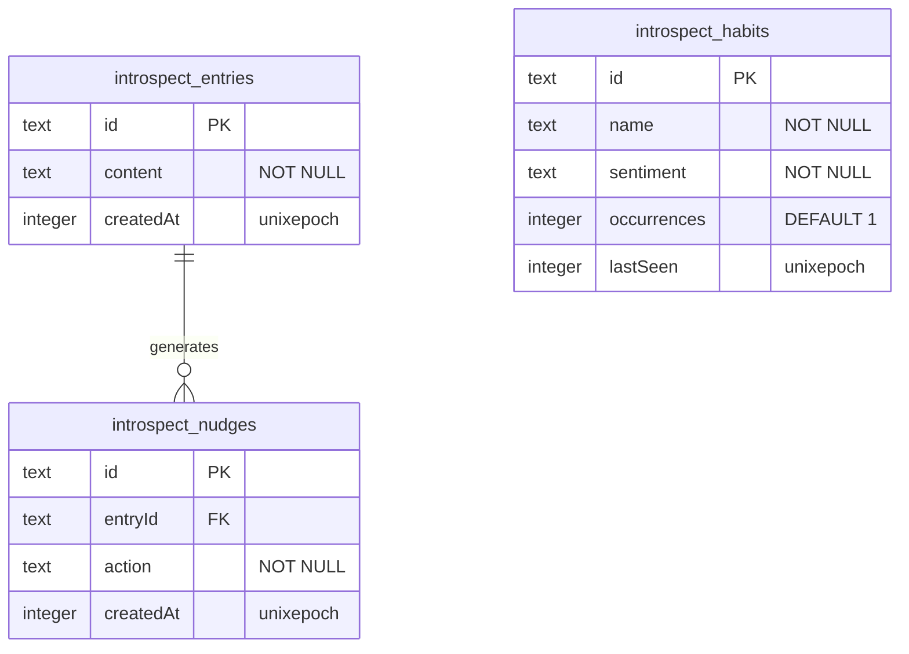

# 💾 Database Layer & Schema Architecture

This article details the SQLite/LibSQL storage layer, the Drizzle ORM configuration, and provides a precise column-by-column breakdown of our database schemas.

---

## ⚙️ Driver: SQLite via LibSQL — Two-Database Model (Phase 5)

Introspect uses **LibSQL** (Turso's SQLite fork) with a **per-user database architecture**. There is no single shared database — each user gets their own isolated Turso database provisioned on signup.

### Two databases in play

| Database | Env var | Dev location | Prod location |
|---|---|---|---|
| **Central users DB** | `USERS_DATABASE_URL` | `file:./users.db` | Turso remote |
| **Per-user app DB** | Stored in JWT session | `file:./user-{id}.sqlite` | Turso remote (auto-provisioned) |

### DB client factory — `src/server/db/index.ts`

The old singleton `db` export is gone. Instead, a factory creates per-user connections:

```typescript
const dbCache = new Map<string, DrizzleInstance>();

export function createUserDb(url: string, authToken?: string) {
  const cached = dbCache.get(url);
  if (cached) return cached;
  const client = createClient({ url, authToken });
  const db = drizzle(client, { schema });
  dbCache.set(url, db);
  return db;
}
```

The cache key is the database URL — so the same user hitting the same warm Lambda instance reuses the connection. On Vercel serverless, each new cold start creates a fresh connection.

### Central users DB — `src/server/db/users-client.ts`

A separate libsql client (not Drizzle) connects to the users DB. It exposes:
- `initUsersDb()` — `CREATE TABLE IF NOT EXISTS users` (idempotent, called on first signup)
- `getUserByEmail(email)` — case-insensitive lookup
- `createUser({ id, email, passwordHash, dbUrl, dbAuthToken })` — inserts a new user row

The `users` table schema (raw SQL, not Drizzle-managed):
```sql
CREATE TABLE IF NOT EXISTS users (
  id TEXT PRIMARY KEY NOT NULL,
  email TEXT NOT NULL,
  passwordHash TEXT NOT NULL,
  dbUrl TEXT NOT NULL,
  dbAuthToken TEXT NOT NULL,
  createdAt INTEGER DEFAULT (unixepoch())
)
```

---

## 🛠️ Drizzle ORM Configuration

Our tables are managed using **Drizzle ORM** and configured in `drizzle.config.ts` at the root of the workspace.

```typescript
import { type Config } from "drizzle-kit";
import { env } from "~/env";

export default {
  schema: "./src/server/db/schema.ts",
  dialect: "sqlite",
  dbCredentials: {
    url: env.DATABASE_URL,
  },
  tablesFilter: ["introspect_*"], // Restricts migrations and pushes strictly to our tables
} satisfies Config;
```

### Table Name Prefixing
To ensure our application stays cleanly isolated when sharing databases, we use the `sqliteTableCreator` utility in `schema.ts`. This automatically prefixes all generated SQLite tables with `introspect_`:
```typescript
export const createTable = sqliteTableCreator((name) => `introspect_${name}`);
```

---

## 📊 Database Schema Details

We maintain **three core tables** that form the operational backbone of the Introspect user workflow:



---

### 1. `introspect_entries` ✓ Active (Phase 2)
Stores activity check-in entries — timestamped logs of what the user has done since their last check-in. This is **not** a reflective journal; it's a structured activity log that Phase 3 AI will mine for habit patterns.

* **Drizzle Definition**:
  ```typescript
  export const entries = createTable("entries", (d) => ({
    id: d.text().primaryKey(),
    content: d.text().notNull(),
    createdAt: d.integer().default(sql`(unixepoch())`),
  }));
  ```
* **Column Breakdown**:

| SQLite Column | Drizzle Type | SQL Modifiers | Default Value | Notes |
|---|---|---|---|---|
| `id` | `text` | `PRIMARY KEY` | *None* | Assigned a UUIDv4 on creation client-side. |
| `content` | `text` | `NOT NULL` | *None* | Stores the raw activity check-in text (e.g. "Woke up, ran 5km, made breakfast, read for 30 min"). |
| `createdAt` | `integer` | `DEFAULT` | `(unixepoch())` | Represents the entry date/time in Unix timestamp format. |

---

### 2. `introspect_habits`
Stores unique habits extracted from the journal entries. New entries are parsed by Gemini to increment counts and update sentiment.

* **Drizzle Definition**:
  ```typescript
  export const habits = createTable("habits", (d) => ({
    id: d.text().primaryKey(),
    name: d.text().notNull(),
    sentiment: d.text().notNull(),
    occurrences: d.integer().default(1),
    lastSeen: d.integer(),
  }));
  ```
* **Column Breakdown**:

| SQLite Column | Drizzle Type | SQL Modifiers | Default Value | Notes |
|---|---|---|---|---|
| `id` | `text` | `PRIMARY KEY` | *None* | Assigned a UUIDv4. |
| `name` | `text` | `NOT NULL` | *None* | The name of the habit (e.g. `"Late night screen time"`, `"Reading"`). |
| `sentiment` | `text` | `NOT NULL` | *None* | Evaluated as either `"positive"`, `"negative"`, or `"neutral"`. |
| `occurrences` | `integer` | `DEFAULT` | `1` | Incrementing counter tracking how many times Gemini extracts this habit. |
| `lastSeen` | `integer` | *None* | *None* | Unix timestamp indicating when the habit was last detected. |

---

### 3. `introspect_nudges`
Stores specific, highly actionable, 2-minute behavioral nudges generated in response to a user entry.

* **Drizzle Definition**:
  ```typescript
  export const nudges = createTable("nudges", (d) => ({
    id: d.text().primaryKey(),
    entryId: d.text(),
    action: d.text().notNull(),
    createdAt: d.integer().default(sql`(unixepoch())`),
  }));
  ```
* **Column Breakdown**:

| SQLite Column | Drizzle Type | SQL Modifiers | Default Value | Notes |
|---|---|---|---|---|
| `id` | `text` | `PRIMARY KEY` | *None* | Assigned a UUIDv4. |
| `entryId` | `text` | *None* | *None* | Foreign Key reference back to `introspect_entries.id`. |
| `action` | `text` | `NOT NULL` | *None* | The 2-minute actionable nudge text (e.g. `"Put your phone in the drawer now."`). |
| `createdAt` | `integer` | `DEFAULT` | `(unixepoch())` | Unix timestamp of generation. |

---

## 🔄 Schema Synchronization Command reference

Because SQLite handles lightweight, destructive pushes extremely easily, we do not need to generate migration files during active feature prototyping. Instead, we use Drizzle Kit pushes:

### Pushing Schema Changes to local database
```bash
npm run db:push
```
This inspects `schema.ts`, compares it against the table schemas inside `db.sqlite`, and alters/creates tables dynamically without losing existing local development data (as long as fields aren't marked `NOT NULL` without defaults).

### Running database viewer UI (Drizzle Studio)
To browse the database tables in a beautiful visual interface during debugging:
```bash
npx drizzle-kit studio
```
This launches a database explorer dashboard locally at `https://local.drizzle.studio`.
